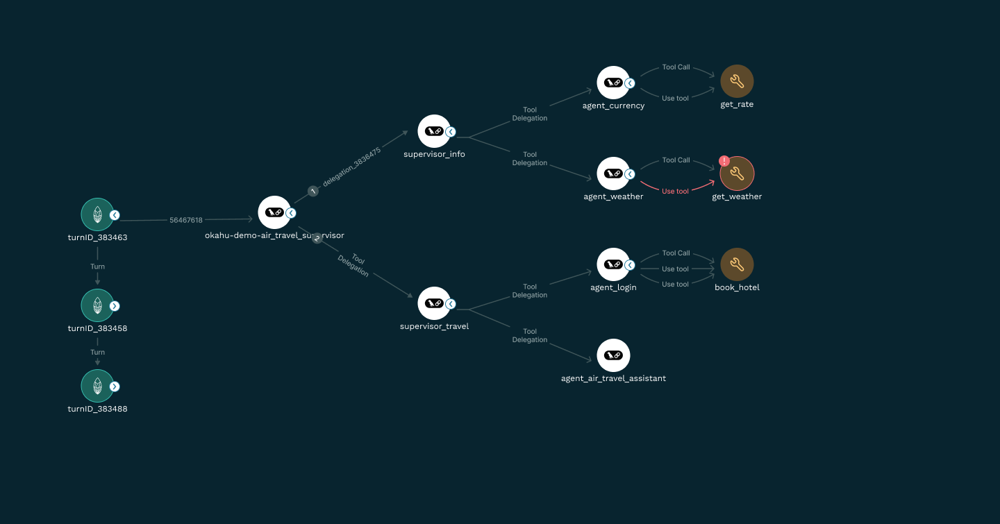
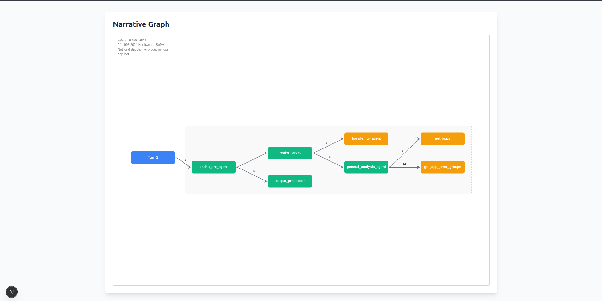

# GoJs Narrative Graph POC

## How to run the project

1. Clone the repository
2. Install dependencies

```bash
npm run dev
# or
yarn dev
# or
pnpm dev
# or
bun dev
```

3. Open [http://localhost:3000](http://localhost:3000) with your browser to see the result.

This is what we require


With reference to the above design, we have been able to achieve a major part of the requirements. **We are facing difficulty is implementing the multiple links between two nodes**. The example of what we want to achieve in given in the above image between `agent-login` and `book-hotel`

This is the current state of the project


If you take a look at this image, you will find the problem area in the nodes between `general_analysis_agent` and `get_app_error_groups`

NOTE: Other features that you see in the Figma but not in the poc rendering are not implemented yet. We are currently focusing on the multiple links between two nodes. Once we have that working, we will move on to implementing the other features. We are also confident on being able to achieve those.

## Requirement from GoJs Team

We would need your help if being able to render multiple parallel links between two nodes.

## Notes

`/app/data.ts` contains the data. We are using different data set for the vertical and the horizontal graph.

`/app/Graph.tsx` contains the main graph component where we are using GoJs to render the graph. You can find the logic for rendering the nodes and links here.

`/app/transformData.ts` contains the logic for transforming the data into the format that GoJs can understand.
